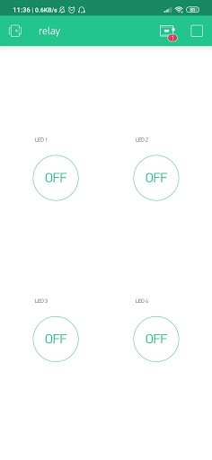

# IoT Project - Blynk Relay Control

## Description

- Relay is a Switch that is operated electrically and is an Electromechanical component consisting of 2 main parts, namely Electromagnet (Coil) and Mechanical (a set of Switch Contacts). Relay uses the Electromagnetic Principle to move the Switch Contact so that with a small electric current (low power) it can conduct electricity with a higher voltage. Relays can be connected to an IoT device so that they can be controlled wirelessly.

## Circuit Schematic:

- <br/>
- Control Relay Circuit Diagram

## Component (Tools & Materials):

- NodeMCU ESP8266 1 unit
- Breadboard 1 unit
- Resistor 220Ω 4 unit
- LED 4 unit
- Relay 4 Channel 1 unit

## Sketch Code Program

```cpp
#define BLYNK_PRINT Serial
#include &amp;lt;ESP8266WiFi.h&amp;gt;
#include &amp;lt;BlynkSimpleEsp8266.h&amp;gt;

char auth[] = "XXXX";           // masukkan kode autentikasi disini
char ssid[] = "Veendy-Suseno";  //nama wifi
char pass[] = "Admin12345";     //password

void setup() { //Pengaturan Variabel
    Serial.begin(9600);
    Blynk.begin(auth, ssid, pass);
}

void loop() {
    Blynk.run();
}
```

## BLYNK Settings:

- In BLYNK, select New Project or press the ⊕ symbol. <br/>
- <br/>
- Image of how to create a New Project.<br/>

- Give the project a name > select the device used > select Create.<br/>
- <br/>
- New Project settings image <br/>

- Once created, select Widget Box ( ⊕ ) then select the Button type.<br/>
- <br/>
- Image of how to select a widget box. <br/>

-  <br/>
- Widget Box Button selection image. <br/>

- Set the button position, then press once on the button to enter settings. <br/>
-  <br/>
- Image of how to enter settings. <br/>

- Name the button > select the circuit output pin > set the signal to 1 – 0 > select SWITCH mode.<br/>
-  <br/>
- Settings image on the Settings Button. <br/>

- To start BLYNK, you can press the start button in the top right corner. <br/>
-  <br/>
- Image of how to start BLYNK. <br/>

## Interface:

 <br/>

- BLYNK Relay Control interface image.

## Conclusion:

- In this project, NodeMCU is controlled by the Blynk application wirelessly to control the LED connected to the Relay. In the Blynk application there is a virtual switch button that controls the digital pin connected to each relay channel connected to the LED.
